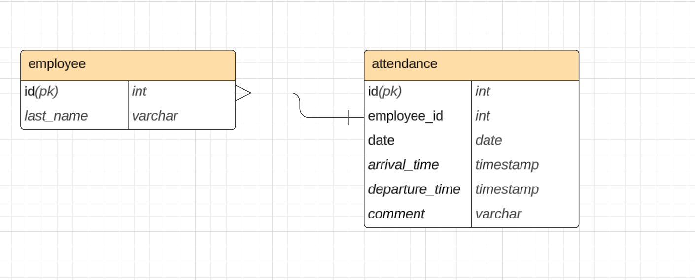

#scrud_parser

### Приложение, выполняющее экпорт данных из excel-файлов определенного формата в реляционную СУБД.

- Для создания бд добавить username и password в config.yaml в основной директории:
- Далее запустить файл db_utils.py:
```commandline
python db_utils.py
```

## Стек технологий
- Pandas - Библиотека для обработки excel-файлов
- mysql-connector-python - Библиотека для взаимодействия с СУБД
- logging - Библиотека для логирования
- PyYAML - Библиотека для работы с файлами в формате YAML.


Cхема БД
