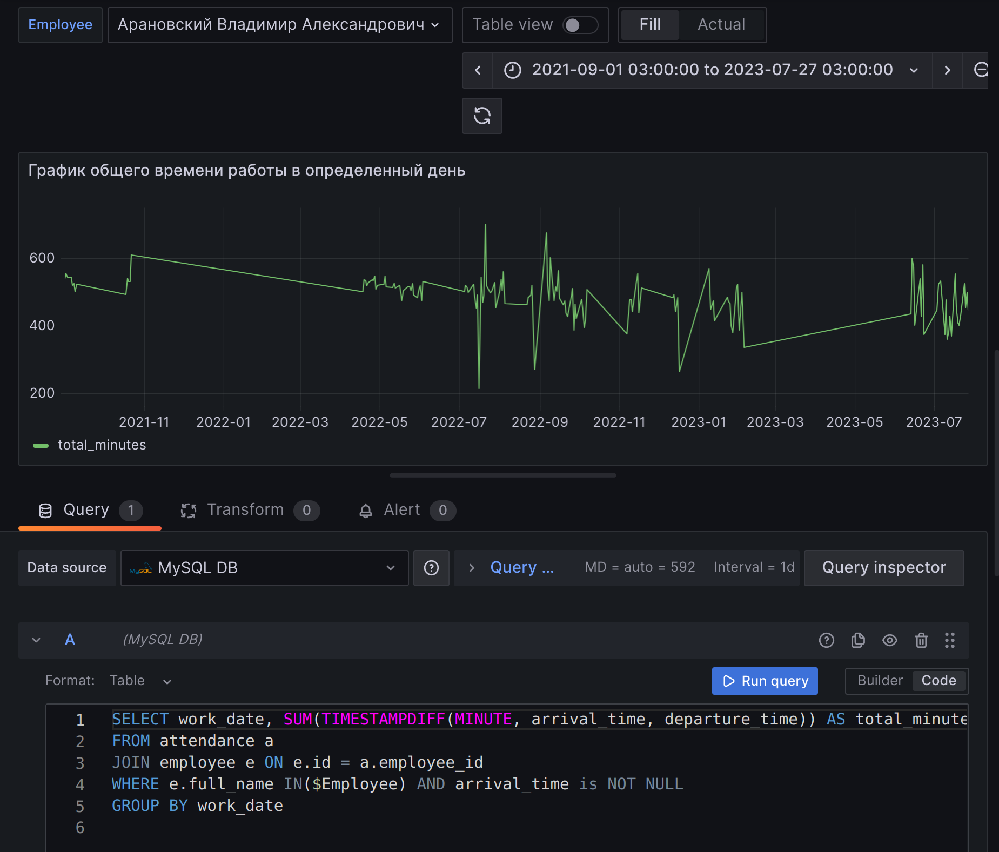
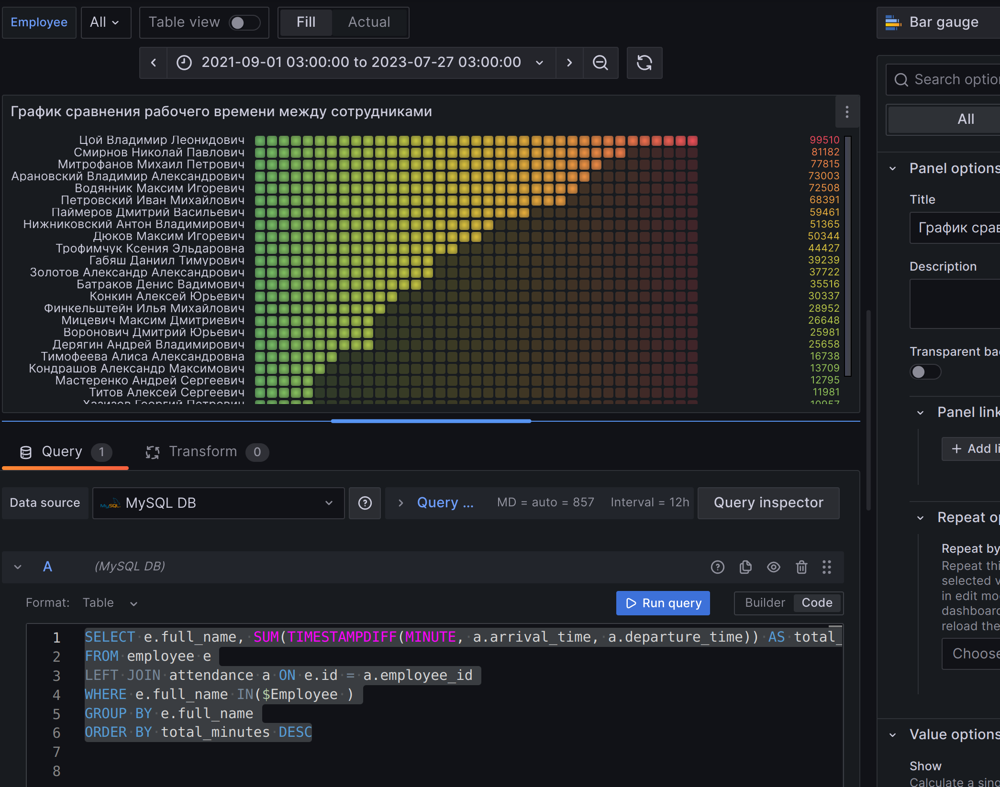
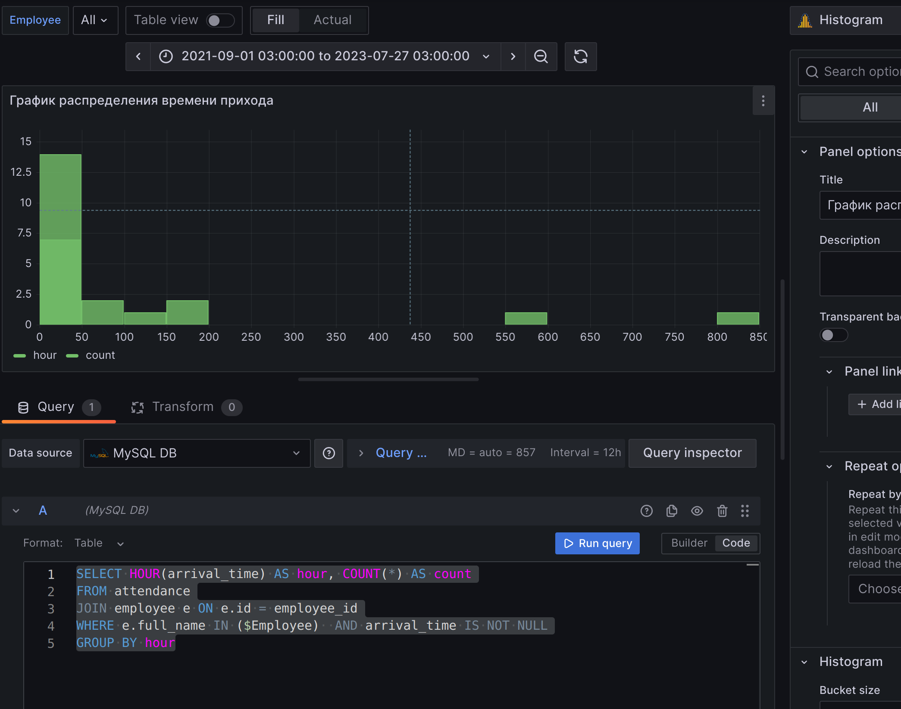
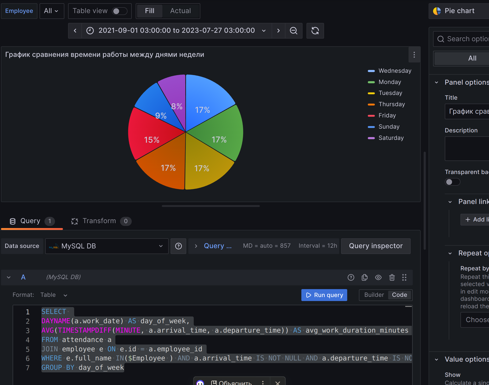

#scrud_parser

### Приложение, выполняющее экпорт данных из excel-файлов определенного формата в реляционную СУБД.

Данное приложение разработано для обработки Excel-файлов по Дисциплине труда сотрудников и экспорта из них информации в реляционную базу данных.

- Для начала работы нужно добавить username и password вашей бд в config.yaml
- Установить зависимости командой:
```commandline
pip install -r requirements.txt
```
- Перейти в папку src:
```commandline
cd src
```
Режимы работы парсера:
- Создать базу данных:
```commandline
python main.py execute_db
```
- Удалить базу данных:
```commandline
python main.py delete_db
```
- Импортировать данные из Excel(при этом передается путь к папке, содержащей exel файлы:
```commandline
python main.py import путь_до_папки          
```
## Работа с Grafana

В данном разделе будет показано, как визуализировать данные из таблицы "Посещаемости сотрудников" в Grafana.

1. Создание Дашборда:
- На главной панели Grafana выберите "Create" -> "Dashboard" или "New Dashboard".
2. Добавление переменной:
   Чтобы удобно фильтровать данные, создайте переменную:
 - Откройте настройки Дашборда и выберете "Variables" -> "New variable"
 - Введите имя переменной "Employee"
 - Выберите источник данных.
 - В поле "Query" введите SQL-запрос для получения списка сотрудников: `SELECT full_name FROM employee;`
 - В разделе "Selection options" отметьте "Multi-value" и "Include All option".

После создание переменной приступайте к созданию новой панели:
- Нажмите на "Add new panel" или "Add Panel" для создания нового графика.

1. График общего времени работы в определенный день
SQL query:
```sql
SELECT 
    work_date, 
    SUM(TIMESTAMPDIFF(MINUTE, arrival_time, departure_time)) AS total_minutes
FROM attendance a
JOIN employee e ON e.id = a.employee_id
WHERE e.full_name IN($Employee) 
AND arrival_time is NOT NULL
GROUP BY work_date
```
Вид графика: Time series

Пример:


2. График сравнения рабочего времени между сотрудниками
SQL query:
```sql
SELECT 
    e.full_name, 
    SUM(TIMESTAMPDIFF(MINUTE, a.arrival_time, a.departure_time)) AS total_minutes
FROM employee e
LEFT JOIN attendance a ON e.id = a.employee_id
WHERE e.full_name IN($Employee )
GROUP BY e.full_name
ORDER BY total_minutes DESC
```
Вид графика: Bar gauge

Пример:


3. График распределения времени прихода
SQL query:
```sql
SELECT 
    HOUR(arrival_time) AS hour, 
    COUNT(*) AS count
FROM attendance
JOIN employee e ON e.id = employee_id
WHERE e.full_name IN ($Employee)  
AND arrival_time IS NOT NULL
GROUP BY hour
```
Вид графика: Histogram

Пример:


4. График сравнения времени работы между днями недели
SQL query:
```sql
SELECT 
    DAYNAME(a.work_date) AS day_of_week,
    AVG(TIMESTAMPDIFF(MINUTE, a.arrival_time, a.departure_time)) AS avg_work_duration_minutes
FROM attendance a
JOIN employee e ON e.id = a.employee_id
WHERE e.full_name IN($Employee ) 
AND a.arrival_time IS NOT NULL 
AND a.departure_time IS NOT NULL
GROUP BY day_of_week
```
Вид графика: Pie chart

Пример:


## Стек технологий
- Python 3.10
- Pandas
- MySQL
- logging
- PyYAML

Автор: [Провоторова Алина Игоревна](https://t.me/alinamalina998)
